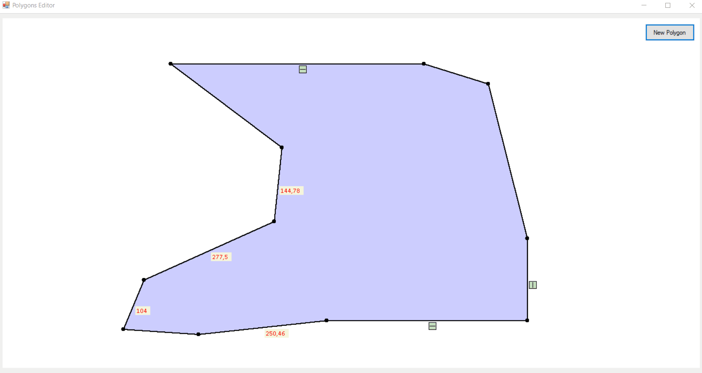
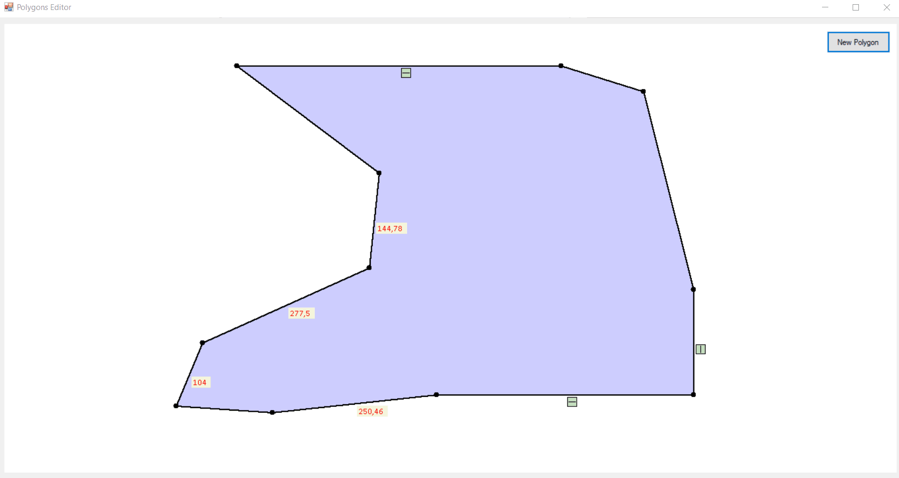
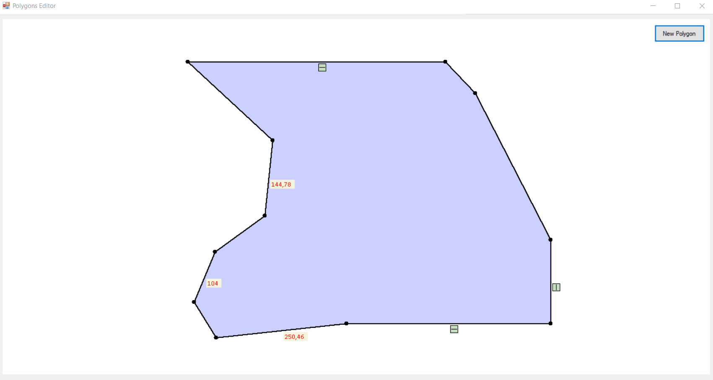
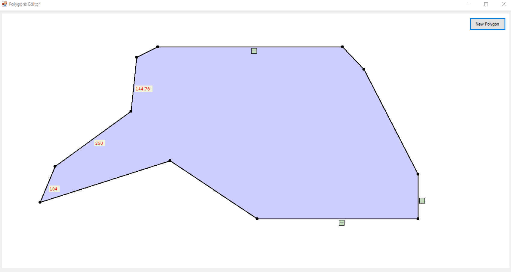

# Polygon Editor
Polygon editor programmed in C# with Windows Forms. 

## Functionalities and user guide

### Adding and deleting polygons
1. To add a new polygon, click "New Polygon" button. You add subsequent vertices with clicking on desired locations (left mouse button). To add the last vertice - left double-click.
2. To delete a polygon, right click on the polygon and choose "Delete Polygon" from the context menu. 

### Editing
1. To move a vertice, edge or polygon, left click on desired object and move having left mouse button pressed.
2. To delete a vertice, right click on the desired vertice and choose "Delete vertice" form context menu. 
3. To add a vertice in the middle of the edge, right click on the edge and choose "Add vertice" form context menu.

### Edges' constraints and relations
1. Possible constraints: edge always vertical, edge always horizontal, edge with fixed length.
2. To add a constraint to the edge, right click on the edge and choose desired constraint from context menu (choosed constraint is marked with a blue backlight and an icon next to the edge).
3. To remove a constraint form the edge, right click on the edge and choose a constraint to remove. 

